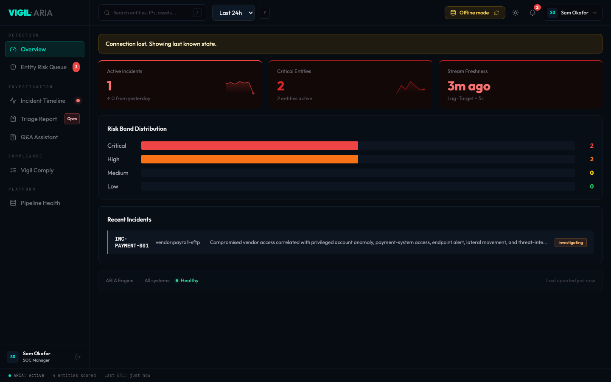
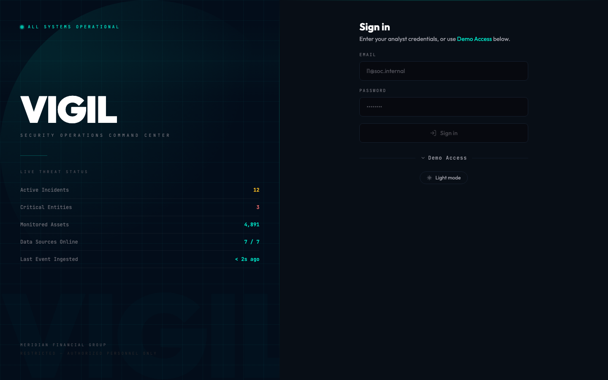
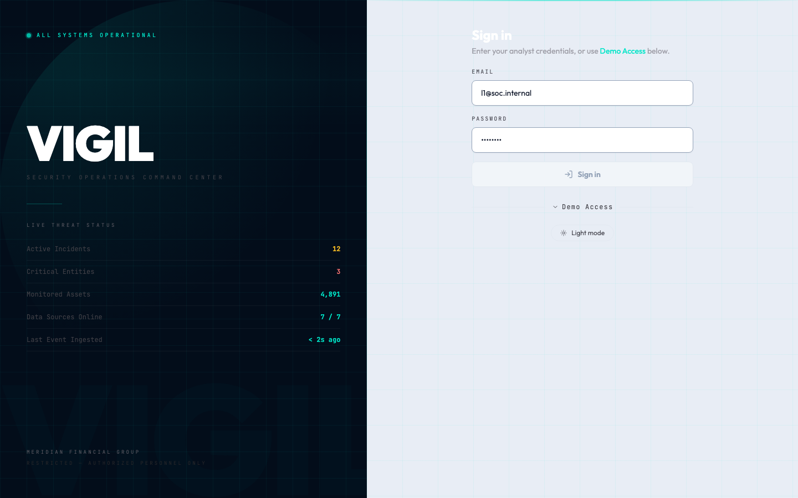
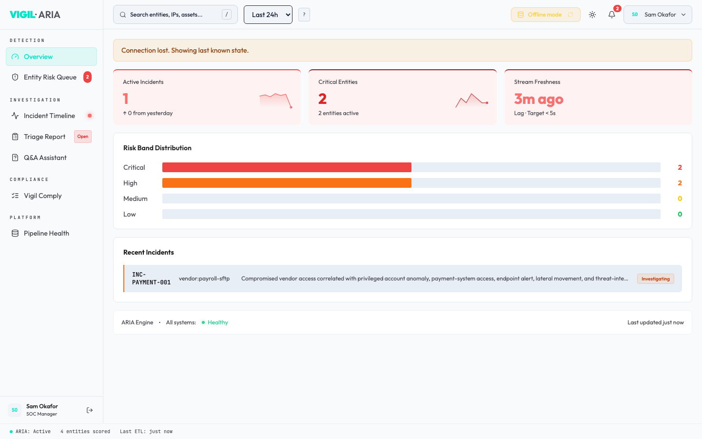
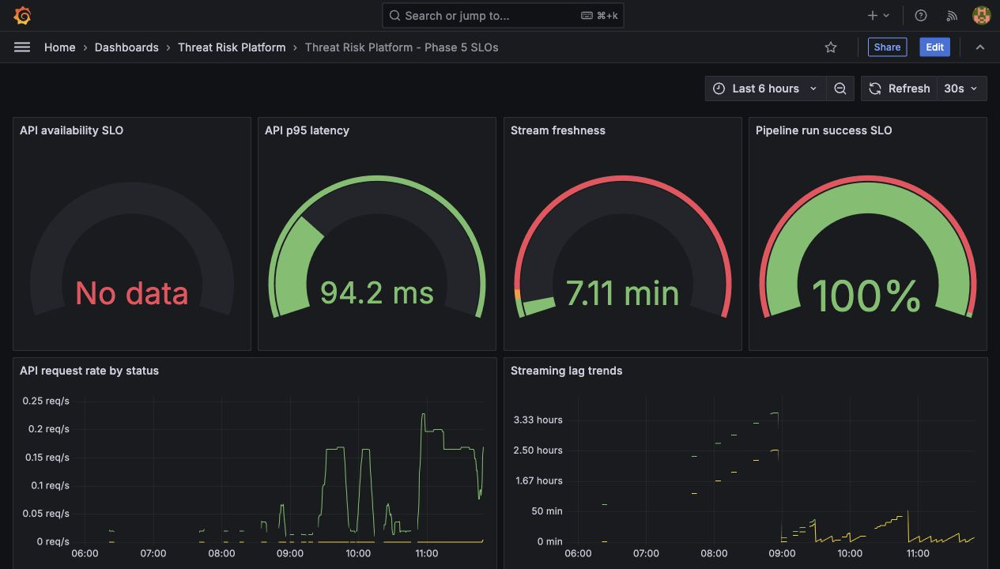
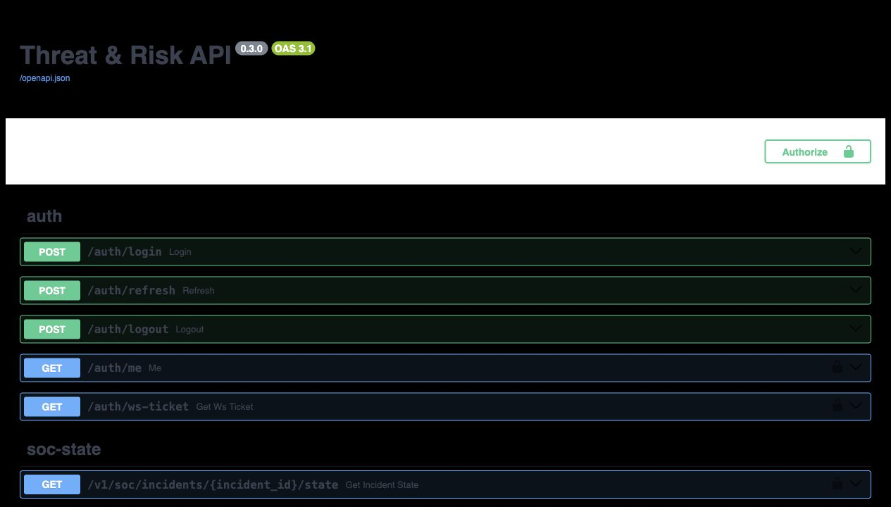
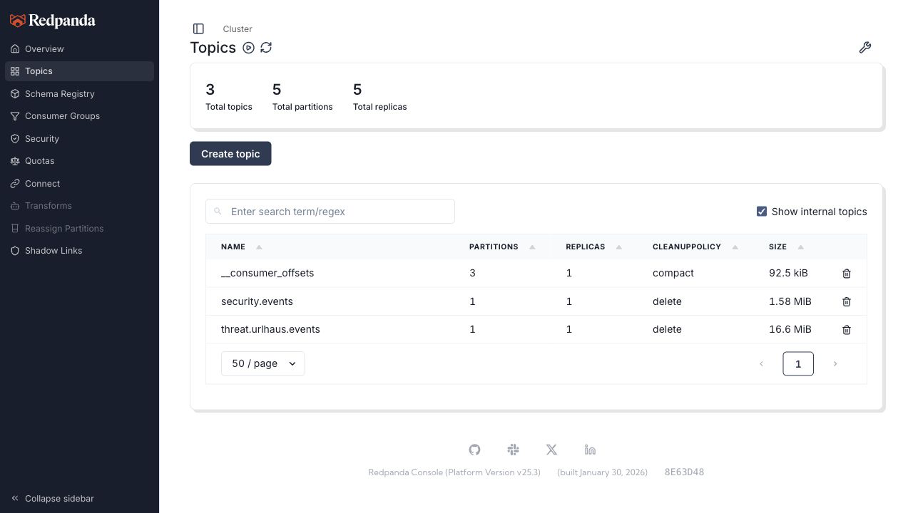

# Vigil — SOC Command Center

**Production-style threat intelligence and security operations platform, built on a full data engineering stack.**

[](https://github.com/aagamshah15/threat-risk-analytics-platform/actions/workflows/ci.yml)
[](LICENSE)



---

## What it is

Vigil is a local-first SOC analytics platform that ingests real threat intelligence feeds, generates synthetic security events, correlates them into incidents and risk scores, and presents them through a purpose-built command center UI. It runs entirely on Docker with one command.

The platform is designed to demonstrate end-to-end data engineering and security engineering patterns — streaming ingestion, ELT pipelines, dbt transformation, JWT-authenticated APIs, WebSocket real-time feeds, and operational observability — all production-ready in a local environment.

## Skills demonstrated

- **Streaming data engineering** — Kafka-compatible producers/consumers (Redpanda), idempotent upserts, Bronze lake on S3-compatible object storage
- **Batch ELT + transformation** — dbt Core with staging models, dimension/fact marts, SOC risk marts, source freshness checks and data tests
- **API development** — FastAPI with JWT auth, API key middleware, single-use WebSocket tickets, Prometheus metrics, optimistic-locking state updates
- **React frontend** — Full SOC command center with real-time WebSocket feed, dark/light theme, analyst workflow state, role-based views
- **Observability** — Prometheus, Grafana SLO dashboards, Alertmanager with local alert sink
- **Orchestration** — Prefect flows for batch, streaming health checks, and dbt builds
- **Security engineering** — JWT auth with refresh tokens, hardened auth middleware, Bandit + pip-audit in CI, SECURITY.md policy
- **CI/CD** — GitHub Actions: ruff, Bandit, pip-audit, dbt build + tests, pytest, React lint/build, Docker Compose config validation

## Quick start

```bash
cp .env.example .env
make demo-up
```

That's it. The full Phase 8 stack starts, SQL migrations apply, dbt models build, and the SOC scenario loads. Takes ~60 seconds on first run.

```bash
make demo-down      # stop, preserve volumes
make reset-p8       # wipe volumes for a clean restart
```

### Prerequisites

- Docker and Docker Compose
- GNU Make
- Git

Optionally set `GITHUB_TOKEN`, `GITHUB_USERNAME`, and `OTX_API_KEY` in `.env` to activate the live GitHub activity and threat intel producers. The platform runs fully on synthetic data without them.

## Live services

| Service | URL |
| --- | --- |
| **Vigil SOC UI** | http://localhost:8600 |
| **FastAPI docs** | http://localhost:8000/docs |
| Streamlit dashboard | http://localhost:8501 |
| Grafana | http://localhost:3000 |
| Prometheus | http://localhost:9090 |
| Redpanda UI | http://localhost:8080 |
| MinIO console | http://localhost:9001 |
| Prefect | http://localhost:4200 |

### Demo credentials

Local demo mode seeds five analyst accounts (password: `changeme` for all):

| Role | Email |
| --- | --- |
| L1 Analyst | `l1@soc.internal` |
| L2 Analyst | `l2@soc.internal` |
| SOC Manager | `manager@soc.internal` |
| CISO | `ciso@soc.internal` |
| Compliance Officer | `compliance@soc.internal` |

## Architecture

Threat data flows through five stages:

1. **Ingest** — Python ELT jobs pull CISA KEV and URLhaus; producers stream SOC events, GitHub activity, and IOC enrichment into Redpanda
2. **Land** — Consumers write append-only JSONL batches to MinIO Bronze and upsert into Postgres raw tables
3. **Transform** — dbt builds staging → dimensions → facts → SOC risk marts (entity risk, incident timelines, compliance evidence, analyst Q&A)
4. **Serve** — FastAPI exposes REST + WebSocket endpoints behind JWT/API key auth; nginx serves the React UI and proxies `/api`
5. **Observe** — Prometheus scrapes metrics; Grafana provisions SLO dashboards; Alertmanager routes alerts to a local sink


<details>
<summary>More screenshots</summary>









</details>

## Tech stack

| Layer | Tools |
| --- | --- |
| Ingestion | Python, CISA KEV, URLhaus, GitHub Events API, OTX/ThreatFox IOC feeds |
| Streaming | Redpanda (Kafka-compatible), custom producers and consumers |
| Storage | MinIO (S3-compatible Bronze lake), PostgreSQL |
| Transformation | dbt Core — staging, dimensions, facts, SOC marts |
| Orchestration | Prefect |
| API | FastAPI — JWT auth, API key mode, WebSockets, Prometheus metrics |
| Frontend | React 18, Tailwind CSS, nginx |
| Observability | Prometheus, Grafana, Alertmanager |
| CI / Quality | GitHub Actions, pytest, ruff, Bandit, pip-audit, dbt tests, ESLint |
| Runtime | Docker Compose, GNU Make |

## Key configuration

Copy `.env.example` to `.env`. Most settings work as-is for local demo. Notable variables:

| Variable | Default | Notes |
| --- | --- | --- |
| `JWT_AUTH_ENABLED` | `false` | Enable JWT enforcement on SOC endpoints |
| `JWT_SECRET` | placeholder | Required when JWT auth is on — `openssl rand -hex 32` |
| `PRODUCTION_MODE` | `false` | Enables strict startup secret validation |
| `API_AUTH_ENABLED` | `false` | API key enforcement toggle |
| `SEED_DEMO_USERS` | `true` | Seeds analyst accounts on first start |
| `GITHUB_TOKEN` | unset | Optional — activates live GitHub producer |
| `OTX_API_KEY` | unset | Optional — activates live threat intel producer |

For production-hardened auth:

```bash
JWT_AUTH_ENABLED=true
PRODUCTION_MODE=true
JWT_SECRET=$(openssl rand -hex 32)
COOKIE_SECURE=true
SEED_DEMO_USERS=false
API_CORS_ORIGINS=https://your-ui.example.com
```

## Useful commands

```bash
make demo-up          # start full Phase 8 stack
make demo-down        # stop, keep volumes
make reset-p8         # wipe volumes
make logs-p8          # tail all service logs
make psql             # open psql on the warehouse
make docs-serve       # serve dbt docs at localhost:8080
make backup-postgres  # snapshot Postgres to backups/
make backup-minio     # snapshot MinIO Bronze to backups/
```

## Docs

Full architecture notes, phase guides, and data dictionaries are in [`/docs`](docs/).

- [Data Dictionary](docs/DATA_DICTIONARY.md)
- [SOC Data Dictionary](docs/SOC_DATA_DICTIONARY.md)
- [React SOC Command Center](docs/REACT_SOC_COMMAND_CENTER.md)
- [Security Policy](SECURITY.md)
- [Contributing](CONTRIBUTING.md)

## License

[MIT](LICENSE)
