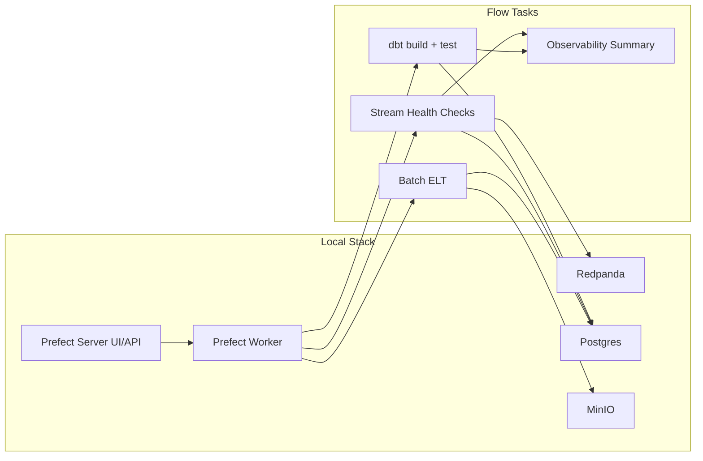

# Phase 3 Architecture (Orchestration + Observability)

## Notes
- Phase 1/2 components are unchanged and still runnable with existing Make targets.
- Phase 3 runs flow code from `orchestration/flows/` and writes run summaries to `artifacts/p3_runs/`.
- Prefect UI is local at `http://localhost:4200`.
